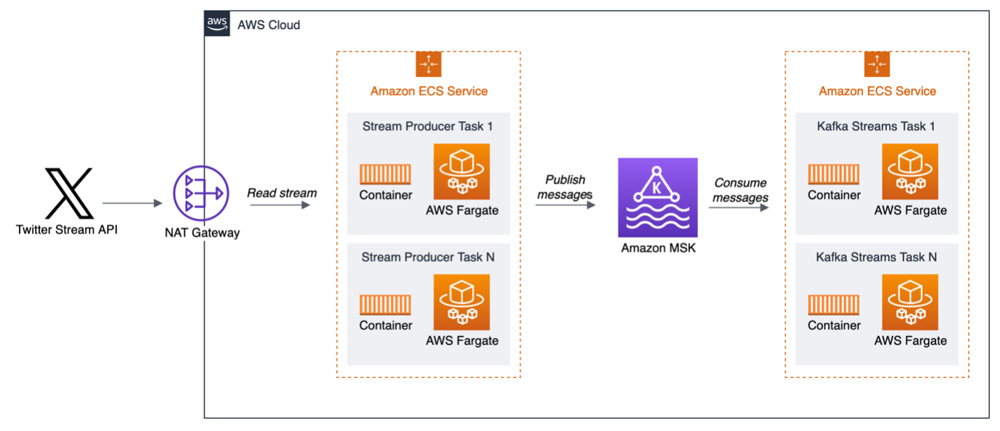

## Running Apache Kafka Streams at scale on AWS Fargate with Amazon MSK
Build a real-time stream processing application using [Amazon MSK](https://aws.amazon.com/msk/), [AWS Fargate](https://aws.amazon.com/fargate/) and the [Apache Kafka Streams API](https://kafka.apache.org/documentation/streams/). Kafka Streams API is a client library that simplifies development of stream applications. Behind the scenes Kafka Streams library is really an abstraction over standard Kafka Producer and Kafka Consumer API. When you build applications with Kafka Streams library your data streams are automatically made fault tolerant, and are transparently, and elastically distributed over the instances of the applications. Kafka Streams applications are supported by Amazon MSK. AWS Fargate is a serverless compute engine for containers that works with AWS container orchestration services like [Amazon Elastic Container Service (Amazon ECS)](https://aws.amazon.com/ecs/), which allows us to easily run, scale, and secure containerized applications.

## Architecture
Our streaming application architecture will consist of Stream Producer, which will connect to Twitter Stream API, read tweets and publish to MSK. Kafka Streams Processor will consume these messages, perform window aggregation, push to topic result, and also print out to logs. Both apps will be hosted on AWS Fargate as service.

You can find a further details and a more thorough description and discussion of the architecture on the [AWS Big Data Blog]().

## Security

See [CONTRIBUTING](CONTRIBUTING.md#security-issue-notifications) for more information.

## License

This library is licensed under the MIT-0 License. See the LICENSE file.

